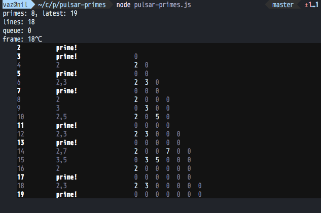

# pulsar-primes

This is a little toy prime-generating CLI NodeJS script.

Just playing with generators and writing generator-based transforms like `map`, `filter`, `take`, etc.

This is a pretty cool way to look at the natural numbers in terms of their prime factors (as well as generating the primes along the way). The pattern displayed as it ticks forward kind of gives a feel for the distribution of the early primes and how they compose together to give the composite numbers.

## Pulsars?

The way this works is by creating generators that *pulse* every *n* ticks, periodically. When a pulsar *pulses*, it yields its *n* value (aka its period), and for every other pulse, it yields a `null`. For example, a *3-pulsar* generates an infinite sequence: `3, null, null, 3, null, null, 3, null, null ...`.

Pulsars can be composed into a "pulsar system", which also yields values once per tick, which are the collection of values yielded by each pulsar in the system (basically it's a lazy `zip` function on an arbitrary number of infinite sequences, where new pulsars can be added while it's running). So a system with a 2-pulsar and 3-pulsar yields a sequence like:

```javascript
[2, 3],
[null, null],
[2, null],
[null, 3],
[2, null],
[null, null],
[2, 3], ...
```

So what this program does is, starting counting upward with `n = 2`, we follow this logic:

- If all the pulsars already in the system just yielded `null` then:
  - `n` is a prime number
  - create a pulsar for this prime number `n` and add it to the system
- Else:
  - `n` is a composite (non-prime) number
  - the set of non-null values yielded during this pulse are `n`'s prime factors

And it prints this sequence in a semi-pretty way.



Non-goals:

- efficiency
- maintainability
- readability to anyone else
- basically everything else


